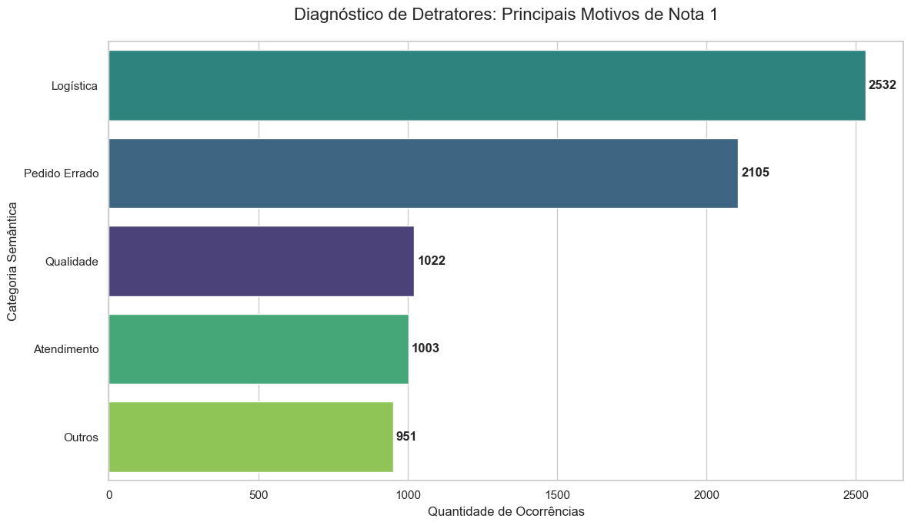
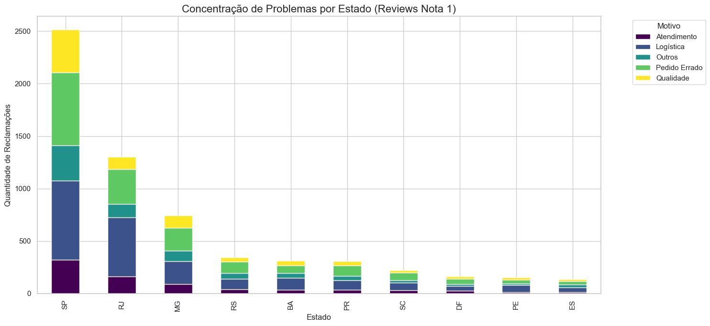
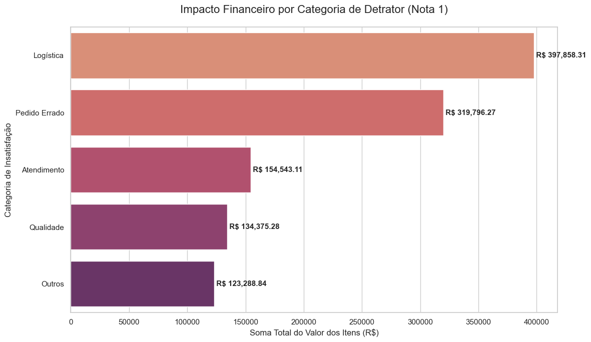

# 📊 Análise Semântica de Detratores — E-commerce Olist


> **Transformando reclamações de clientes em inteligência de negócio.**  
> Análise de +3.000 reviews reais de 1 estrela para identificar falhas operacionais e quantificar seu impacto financeiro.

---

## 🎯 O Problema de Negócio

Uma nota "1 estrela" é um sinal de alerta — mas a nota sozinha não revela **o porquê** da insatisfação. Este projeto responde à pergunta que todo gestor de e-commerce precisa saber:

> *"Onde estamos falhando com nossos clientes e quanto isso nos custa?"*

Utilizando dados reais da [Olist](https://www.kaggle.com/datasets/olistbr/brazilian-ecommerce), o projeto transforma comentários textuais em categorias de falha, localiza geograficamente os problemas e converte insatisfação em impacto financeiro mensurável.

---

## 💡 Resultados Principais

| Métrica | Resultado |
|---|---|
| Reviews analisados | +3.000 comentários de 1 estrela |
| Principal causa de insatisfação | **Logística** (atrasos e não entrega) |
| Região mais afetada | Sudeste — SP e RJ lideram em volume |
| Impacto financeiro em risco | **R$ 1.129.861,81** |
| Categoria de maior risco financeiro | **Pedido Errado** |

### 📌 Insights em linguagem de negócio

- **O problema não é o produto — é a entrega.** Logística domina as reclamações, especialmente no Sudeste. O desafio dos e-commerces brasileiros não é apenas vender, mas vencer a infraestrutura do país.
- **Estados mais distantes sofrem desproporcionalmente.** Em regiões fora do Sudeste, a logística "devora" todas as outras categorias de reclamação — revelando um problema estrutural de cobertura.
- **Insatisfação tem preço.** A categoria "Pedido Errado" coloca em risco R$ 1.129.861,81 em receita — dado suficiente para justificar investimento imediato em processos de separação e conferência.
- **Clientes que escrevem, ensinam.** Ao filtrar apenas comentários com mais de 30 caracteres ("comentários ricos"), isolamos a densidade da reclamação e tornamos a análise semântica mais precisa e acionável.

---

## 📈 Visualizações

> **Distribuição de categorias de reclamação**



> **Mapa geográfico de falhas por estado**



> **Impacto financeiro por categoria**



---

## 🗺️ Jornada Analítica

```
Dados brutos (Kaggle)
        ↓
Filtro: comentários ricos (>30 chars)
        ↓
Classificação semântica por palavras-chave
        ↓
Análise geográfica por estado
        ↓
Cruzamento com valor dos pedidos
        ↓
Impacto financeiro por categoria de falha
```

---

## 🛠️ Tecnologias Utilizadas

- **Python 3.10+** — linguagem principal
- **Pandas** — manipulação e limpeza dos dados
- **Matplotlib / Seaborn** — visualizações
- **NLP com dicionários** — classificação semântica de baixo custo e alta interpretabilidade
- **Jupyter Notebook** — desenvolvimento e documentação

---

## 📂 Estrutura do Projeto

```
📦 Analise-Semantica-de-DetratoresE-commerce-Olist
├── 📁 notebooks/
│   └── Análise Semântica de Detratores - E-commerce Olist.ipynb
├── 📁 datas/
│   └── (datasets originais e processados)
├── 📁 Prints/
│   └── (gráficos gerados na análise)
├── requirements.txt
└── README.md
```

---

## ⚙️ Como Executar

### 1. Clone o repositório
```bash
git clone https://github.com/Dangellsx/Analise-Semantica-de-DetratoresE-commerce-Olist.git
cd Analise-Semantica-de-DetratoresE-commerce-Olist
```

### 2. Instale as dependências
```bash
pip install -r requirements.txt
```

### 3. Execute o notebook
```bash
jupyter notebook notebooks/"Análise Semântica de Detratores - E-commerce Olist.ipynb"
```

> Todos os arquivos de dados já estão incluídos na pasta `datas/`. Nenhuma configuração adicional é necessária.

---

## 📋 Dependências

```
pandas>=2.0.0
matplotlib>=3.7.0
seaborn>=0.12.0
jupyter>=1.0.0
openpyxl>=3.1.0
```

> Arquivo `requirements.txt` disponível na raiz do projeto.

---

## 📚 Fonte dos Dados

[Brazilian E-Commerce Public Dataset by Olist](https://www.kaggle.com/datasets/olistbr/brazilian-ecommerce) — dataset público com dados reais de pedidos, clientes, produtos e avaliações de um marketplace brasileiro.

---

## 👤 Autor

**Dangels Maia Chaves**  
Estudante de Tecnologia da Informação (UFERSA) | Foco em Análise e Ciência de Dados

[](https://www.linkedin.com/in/dangels-maia-chaves/)
[](https://github.com/Dangellsx)
